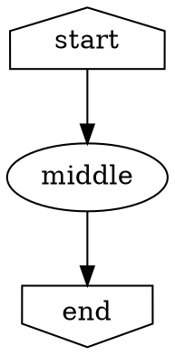

## Dependencies

Diagrammer.Core relies on the following dependencies to PSGraph to facilitate diagram generation and rendering. These dependencies are essential for the module's functionality and performance. PSGraph is a helper module implemented as a DSL (Domain Specific Language) for generating GraphViz graphs. The goal is to make it easier to generate graphs using Powershell. The DSL adds these commands that are explained below.

- **graph**: Defines the overall graph structure and properties.
- **edge**: Represents a connection between two nodes in the graph.
- **node**: Represents an individual element or point in the graph.
- **subgraph**: Groups related nodes and edges within a larger graph.
- **rank**: Specifies the vertical positioning of nodes within the graph.

### Example Usage of PSGraph Commands

```powershell
graph g {
    node start @{shape='house'}
    node end @{shape='invhouse'}
    edge start,middle,end
}
```

### Resulting GraphViz Dot source code

