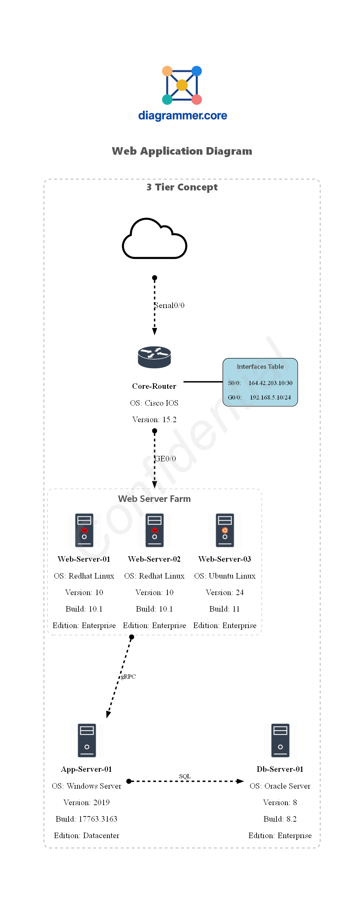
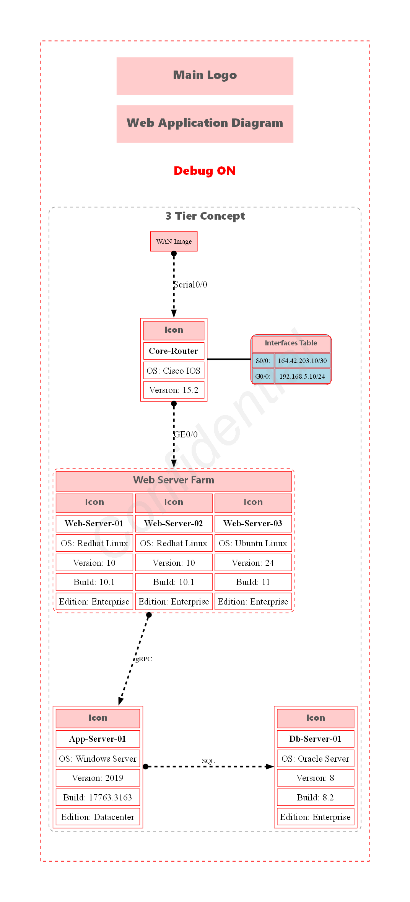

This time, we'll demonstrate the use of the **`WaterMark`** feature (Part of Diagrammer.Core module).

The watermark text is added to the diagram as a background text. The watermark text is not part of the Graphviz source code, but is added to the final image using ImageMagick. In this example, the Confidential watermark text is added to the diagram.

```powershell title="PowerShell: param block"
[CmdletBinding()]
param (
    [System.IO.FileInfo] $Path = '~\Desktop\',
    [array] $Format = @('png'),
    [bool] $DraftMode = $false
)
```

Starting with PowerShell v3, modules are auto-imported when needed. Importing the module here ensures clarity and avoids ambiguity.


```powershell
Import-Module Diagrammer.Core -Force -Verbose:$false
```

Since the diagram output is a file, specify the output folder path using $OutputFolderPath.

```powershell
$OutputFolderPath = Resolve-Path $Path
```

The $MainGraphLabel variable sets the main title of the diagram.

```powershell
$MainGraphLabel = '3tier Web Application Diagram'
```

If the diagram uses custom icons, specify the path to the icons directory. This is a Graphviz requirement.

```powershell
$RootPath = $PSScriptRoot
[System.IO.FileInfo]$IconPath = Join-Path $RootPath 'Icons'
```
The $Images variable is a hashtable containing the names of image files used in the diagram.The image files must be located in the directory specified by $IconPath.

** Image sizes should be around 100x100, 150x150 pixels for optimal display. **

```powershell
$script:Images = @{
    "Main_Logo" = "Diagrammer.png"
    "Server" = "Server.png"
    "ServerRedhat" = "Linux_Server_RedHat.png"
    "ServerUbuntu" = "Linux_Server_Ubuntu.png"
    "Cloud" = "Cloud.png"
    "Router" = "Router.png"
    "Logo_Footer" = "Signature_Logo.png"
}
```

This section creates custom objects to hold server information, which are used to set node labels in the diagram.

```powershell
$AppServerInfo = [PSCustomObject][ordered]@{
    'OS' = 'Windows Server'
    'Version' = '2019'
    'Build' = "17763.3163"
    'Edition' = "Datacenter"
}

$DBServerInfo = [PSCustomObject][ordered]@{
    'OS' = 'Oracle Server'
    'Version' = '8'
    'Build' = "8.2"
    'Edition' = "Enterprise"
}
```

In this section we demonstrates the use of the **`Add-DiaHTMLTable`** to create a list table to display additional information about a object (Part of Diagrammer.Core module).

To improve the diagram, we'll add a network router and a cloud icon to represent the WAN/Internet connection. We'll also include a table to display the router's network interface information.

The rank directive is used to align nodes horizontally.

```powershell linenums="1" title="Example12.ps1 - WaterMark feature"
$example12 = & {
    SubGraph 3tier -Attributes @{Label = '3 Tier Concept'; fontsize = 18; penwidth = 1.5; labelloc = 't'; style = "dashed,rounded"; color = "gray" } {

        $WebServerFarm = @(
            @{
                Name = 'Web-Server-01';
                AdditionalInfo = [PSCustomObject][ordered]@{
                    'OS' = 'Redhat Linux'
                    'Version' = '10'
                    'Build' = "10.1"
                    'Edition' = "Enterprise"
                }
                IconType = "ServerRedhat"
            },
            @{
                Name = 'Web-Server-02';
                AdditionalInfo = [PSCustomObject][ordered]@{
                    'OS' = 'Redhat Linux'
                    'Version' = '10'
                    'Build' = "10.1"
                    'Edition' = "Enterprise"
                }
                IconType = "ServerRedhat"
            },
            @{
                Name = 'Web-Server-03';
                AdditionalInfo = [PSCustomObject][ordered]@{
                    'OS' = 'Ubuntu Linux'
                    'Version' = '24'
                    'Build' = "11"
                    'Edition' = "Enterprise"
                }
                IconType = "ServerUbuntu"
            }
        )

        $Web01Label = Add-DiaHTMLNodeTable -ImagesObj $Images -inputObject $WebServerFarm.Name -iconType $WebServerFarm.IconType -columnSize 3 -AditionalInfo $WebServerFarm.AdditionalInfo -Subgraph -SubgraphLabel "Web Server Farm" -SubgraphLabelPos "top" -SubgraphTableStyle "dashed,rounded" -TableBorderColor "gray" -TableBorder "1" -SubgraphLabelFontsize 20 -fontSize 18 -MultiIcon -DraftMode:$DraftMode


        $App01Label = Add-DiaNodeIcon -Name 'App-Server-01' -AditionalInfo $AppServerInfo -ImagesObj $Images -IconType "Server" -Align "Center" -FontSize 18 -DraftMode:$DraftMode
        $DB01Label = Add-DiaNodeIcon -Name 'Db-Server-01' -AditionalInfo $DBServerInfo -ImagesObj $Images -IconType "Server" -Align "Center" -FontSize 18 -DraftMode:$DraftMode

        Node -Name Web01 -Attributes @{Label = $Web01Label ; shape = 'plain'; fillColor = 'transparent'; fontsize = 14 }
        Node -Name App01 -Attributes @{ Label = $App01Label ; shape = 'plain'; fillColor = 'transparent'; fontsize = 14 }
        Node -Name DB01 -Attributes @{Label = $DB01Label; shape = 'plain'; fillColor = 'transparent'; fontsize = 14 }

        Edge -From Web01 -To App01 @{label = 'gRPC'; color = 'black'; fontsize = 12; fontcolor = 'black'; minlen = 3 }
        Edge -From App01 -To DB01 @{label = 'SQL'; color = 'black'; fontsize = 12; fontcolor = 'black'; minlen = 3 }

        Rank -Nodes App01, DB01

        $RouterInfo = [PSCustomObject][ordered]@{
            'OS' = 'Cisco IOS'
            'Version' = '15.2'
        }

        $RouterLabel = Add-DiaNodeIcon -Name 'Core-Router' -AdditionalInfo $RouterInfo -ImagesObj $Images -IconType "Router" -Align "Center" -FontSize 18 -DraftMode:$DraftMode

        Node -Name Router01 -Attributes @{label = $RouterLabel ; shape = 'plain'; fillColor = 'transparent'; fontsize = 14 }

        Edge -From Router01 -To Web01 @{label = 'GE0/0'; color = 'black'; fontsize = 18; fontcolor = 'black'; minlen = 2 }

        Add-DiaNodeImage -Name "WAN" -ImagesObj $Images -IconType "Cloud" -IconPath $IconPath -ImageSizePercent 30 -DraftMode:$DraftMode

        Edge -From WAN -To Router01 @{label = 'Serial0/0'; color = 'black'; fontsize = 18; fontcolor = 'black'; minlen = 2 }

        <#
            In this example, we create a table to display the router's network interface information.
            -Name parameter sets the name of the node (RouterNetworkInfo in this case).
            -Rows parameter takes an array of strings to populate the table rows.
            -NodeObject switch indicates that the table is to be used as a Graphviz Node in the diagram.
                - If this parameter is omitted, the table will be created as a standalone HTML file.
                - If this parameter is omitted, a Node must be created separately and the table assigned to the node's Label attribute.
            -ColumnSize parameter sets the number of columns in the table (2 in this case).
            -Subgraph switch creates a container around the table with a label.
            -SubgraphLabel parameter sets the label for the subgraph container.
            -GraphvizAttributes parameter allows setting additional Graphviz attributes for the node container.
        #>

        $RouterNetworkInfo = @(
            "S0/0:"
            "164.42.203.10/30"
            "G0/0:"
            "192.168.5.10/24"
        )

        Add-DiaHtmlTable -Name 'RouterNetworkInfo' -Rows $RouterNetworkInfo -NodeObject -ColumnSize 2 -TableBorder 1 -TableBorderColor "black" -FontSize 14 -Subgraph -SubgraphLabel "Interfaces Table" -SubgraphLabelPos "top" -SubgraphTableStyle "solid,rounded" -SubgraphLabelFontsize 20 -SubgraphFontUnderline -SubgraphFontBold -DraftMode:$DraftMode -TableBackgroundColor 'lightblue'

        Edge -From Router01 -To RouterNetworkInfo @{color = 'black'; fontsize = 18; fontcolor = 'black'; minlen = 1; style = 'filled'; arrowhead = 'none'; arrowtail = 'none' }

        # Ranking the router and its network info table together to keep them aligned horizontally.
        Rank Router01, RouterNetworkInfo
    }
}
```

The WaterMark feature is demonstrated here, which adds a watermark text to the diagram.

```powershell linenums="1" hl_lines="01-09" title="Example12.ps1 - WaterMark feature"
<#
    The WaterMark attributes define the parameters for the watermark properties of the text.

    -WaterMarkText parameter sets the text for the watermark.
    -WaterMarkColor parameter sets the color of the watermark text.
    -WaterMarkFontOpacity parameter sets the opacity of the watermark text (0-100).
#>

New-Diagrammer -InputObject $example12 -OutputFolderPath $OutputFolderPath -Format $Format -MainDiagramLabel $MainGraphLabel -Filename Example12 -LogoName "Main_Logo" -Direction top-to-bottom -IconPath $IconPath -ImagesObj $Images -WaterMarkText "Confidential" -WaterMarkColor "DarkGray" -WaterMarkFontOpacity 40 -DraftMode:$DraftMode
```

When you run the script, it generates a PNG file named Example12.png in the specified output folder.

**Resulting diagram:**

!!! example

    === "Example 12"

        

    === "Example 12 - DraftMode"

        