** This time, we'll turn on the DraftMode attribute to make it easier to troubleshoot and fine-tune the diagram. **

This is a simple example demonstrating how to create a 3-tier web application diagram using the PSGraph module, without using any object icons.

```powershell title="PowerShell: param block"
[CmdletBinding()]
param (
    [System.IO.FileInfo] $Path = '~\Desktop\',
    [array] $Format = @('png'),
    [bool] $DraftMode = $false
)
```

Starting with PowerShell v3, modules are auto-imported when needed. Importing the module here ensures clarity and avoids ambiguity.


```powershell
Import-Module Diagrammer.Core -Force -Verbose:$false
```

Since the diagram output is a file, specify the output folder path using $OutputFolderPath.

```powershell
$OutputFolderPath = Resolve-Path $Path
```

The $MainGraphLabel variable sets the main title of the diagram.

```powershell
$MainGraphLabel = '3tier Web Application Diagram'
```

If the diagram uses custom icons, specify the path to the icons directory. This is a Graphviz requirement.

```powershell
$RootPath = $PSScriptRoot
[System.IO.FileInfo]$IconPath = Join-Path $RootPath 'icons'
```
The $Images variable is a hashtable containing the names of image files used in the diagram.The image files must be located in the directory specified by $IconPath.

** Image sizes should be around 100x100, 150x150 pixels for optimal display. **

```powershell
$script:Images = @{
    "Main_Logo" = "Diagrammer.png"
    "Server" = "Server.png"
}
```

This section creates custom objects to hold server information, which are used to set node labels in the diagram.

```powershell
$WebServerInfo = [PSCustomObject][ordered]@{
    'OS' = 'Redhat Linux'
    'Version' = '10'
    'Build' = "10.1"
    'Edition' = "Enterprise"
}

$AppServerInfo = [PSCustomObject][ordered]@{
    'OS' = 'Windows Server'
    'Version' = '2019'
    'Build' = "17763.3163"
    'Edition' = "Datacenter"
}

$DBServerInfo = [PSCustomObject][ordered]@{
    'OS' = 'Oracle Server'
    'Version' = '8'
    'Build' = "8.2"
    'Edition' = "Enterprise"
}
```

This time, we demonstrate the use of DraftMode to help with troubleshooting and fine-tuning the diagram.

All Diagrammer cmdlets support the -DraftMode parameter. Setting -DraftMode to $true produces a draft version of the diagram, making it easier to troubleshoot and adjust the layout.

```powershell
$example6 = & {
    SubGraph 3tier -Attributes @{Label = '3 Tier Concept'; fontsize = 18; penwidth = 1.5; labelloc = 't'; style = "dashed,rounded"; color = "gray" } {

        <#
            -AditionalInfo parameter accepts a custom object with properties to display in the node label.
            -Align parameter sets the alignment of the icon and text (Left, Right, Center).
            -ImagesObj parameter passes the hashtable of images defined earlier in the script.
            -FontSize 18 sets the font size for the node label text.
        #>

        $Web01Label = Add-DiaNodeIcon -Name 'Web-Server-01' -AditionalInfo $WebServerInfo -ImagesObj $Images -IconType "Server" -Align "Center" -FontSize 18 -DraftMode:$DraftMode
        $App01Label = Add-DiaNodeIcon -Name 'App-Server-01' -AditionalInfo $AppServerInfo -ImagesObj $Images -IconType "Server" -Align "Center" -FontSize 18 -DraftMode:$DraftMode
        $DB01Label = Add-DiaNodeIcon -Name 'Db-Server-01' -AditionalInfo $DBServerInfo -ImagesObj $Images -IconType "Server" -Align "Center" -FontSize 18 -DraftMode:$DraftMode

        Node -Name Web01 -Attributes @{Label = $Web01Label ; shape = 'plain'; fillColor = 'transparent'; fontsize = 14 }
        Node -Name App01 -Attributes @{ Label = $App01Label ; shape = 'plain'; fillColor = 'transparent'; fontsize = 14 }
        Node -Name DB01 -Attributes @{Label = $DB01Label; shape = 'plain'; fillColor = 'transparent'; fontsize = 14 }

        Edge -From Web01 -To App01 @{label = 'gRPC'; color = 'black'; fontsize = 12; fontcolor = 'black'; minlen = 3 }
        Edge -From App01 -To DB01 @{label = 'SQL'; color = 'black'; fontsize = 12; fontcolor = 'black'; minlen = 3 }
    }
}
```

Finally, call the New-Diagrammer cmdlet with the specified parameters.

```powershell
New-Diagrammer -InputObject $example6 -OutputFolderPath $OutputFolderPath -Format $Format -MainDiagramLabel $MainGraphLabel -Filename Example6 -LogoName "Main_Logo"  -DraftMode:$DraftMode
```

When you run the script, it generates a PNG file named Example6.png in the specified output folder.

### Resulting diagram:

When enabled, the **DraftMode** feature generates a simplified, draft version of the diagram. This mode highlights layout boundaries, disables advanced rendering options, and uses placeholder icons or labels, making it easier to identify alignment issues, spacing problems, and node relationships. DraftMode is especially useful during the design and troubleshooting phase, allowing you to quickly iterate and fine-tune the diagram before producing the final polished output.

```graphviz dot example6.png
digraph Root {
	graph [bb="0,0,434,1529",
		bgcolor=White,
		compound=true,
		fontcolor="#565656",
		fontname="Segoe Ui Black",
		fontsize=32,
		imagepath="C:\Users\jocolon\Documents\WindowsPowerShell\Modules\Diagrammer.Core\Examples\icons",
		labelloc=t,
		nodesep=0.6,
		pad=1,
		penwidth=1.5,
		rankdir=TB,
		ranksep=0.75,
		splines=line,
		style=dashed
	];
	node [fillcolor="#71797E",
		fontcolor=Black,
		fontsize=14,
		imagescale=True,
		label="\N",
		labelloc=t,
		shape=none,
		style=filled
	];
	edge [arrowsize=1,
		arrowtail=dot,
		color="#71797E",
		dir=both,
		fontcolor="#71797E",
		penwidth=3,
		style=dashed
	];
	subgraph clusterOUTERDRAWBOARD1 {
		graph [bb="8,8,426,1521",
			color=red,
			fontsize=24,
			label=" ",
			labeljust=r,
			labelloc=b,
			lheight=0.47,
			lp="414.62,28.875",
			lwidth=0.09,
			penwidth=1.5,
			style=dashed
		];
		subgraph clusterMainGraph {
			graph [bb="16,57.75,418,1513",
				fontsize=24,
				label=<<TABLE border='0' cellborder='0' cellspacing='20' cellpadding='20'><TR><TD bgcolor='#FFCCCC' ALIGN='center' colspan='1'>Main Logo</TD></TR><TR><TD bgcolor='#FFCCCC' ALIGN='center' ><FONT FACE='Segoe Ui Black' Color='#565656' POINT-SIZE='24'>Web Application Diagram</FONT></TD></TR><TR><TD ALIGN='center'><font color='red'>Debug ON</font></TD></TR></TABLE>>,
				labeljust=c,
				labelloc=t,
				lheight=4.18,
				lp="217,1358.4",
				lwidth=5.37,
				penwidth=0
			];
			subgraph cluster3tier {
				graph [bb="121,65.75,313,1195.8",
					color=darkgray,
					fontsize=18,
					label="3 Tier Concept",
					labelloc=t,
					lheight=0.34,
					lp="217,1179.4",
					lwidth=1.75,
					penwidth=1.5,
					style="dashed,rounded"
				];
				Web01	[fillcolor=transparent,
					height=3.316,
					label=<<TABLE color='red' border='1' cellborder='1' cellspacing='5' cellpadding='5'><TR><TD bgcolor='#FFCCCC' ALIGN='Center' colspan='1'><FONT FACE='Segoe Ui Black' Color='#565656' POINT-SIZE='18'>Icon</FONT></TD></TR><TR><TD align='Center'><B><FONT POINT-SIZE='18'>Web-Server-01</FONT></B></TD></TR><TR><TD align='Center' colspan='1'><FONT POINT-SIZE='18'>OS: Redhat Linux</FONT></TD></TR> <TR><TD align='Center' colspan='1'><FONT POINT-SIZE='18'>Version: 10</FONT></TD></TR> <TR><TD align='Center' colspan='1'><FONT POINT-SIZE='18'>Build: 10.1</FONT></TD></TR> <TR><TD align='Center' colspan='1'><FONT POINT-SIZE='18'>Edition: Enterprise</FONT></TD></TR></TABLE>>,
					pos="217,1035.6",
					shape=plain,
					width=2.2604];
				App01	[fillcolor=transparent,
					height=3.316,
					label=<<TABLE color='red' border='1' cellborder='1' cellspacing='5' cellpadding='5'><TR><TD bgcolor='#FFCCCC' ALIGN='Center' colspan='1'><FONT FACE='Segoe Ui Black' Color='#565656' POINT-SIZE='18'>Icon</FONT></TD></TR><TR><TD align='Center'><B><FONT POINT-SIZE='18'>App-Server-01</FONT></B></TD></TR><TR><TD align='Center' colspan='1'><FONT POINT-SIZE='18'>OS: Windows Server</FONT></TD></TR> <TR><TD align='Center' colspan='1'><FONT POINT-SIZE='18'>Version: 2019</FONT></TD></TR> <TR><TD align='Center' colspan='1'><FONT POINT-SIZE='18'>Build: 17763.3163</FONT></TD></TR> <TR><TD align='Center' colspan='1'><FONT POINT-SIZE='18'>Edition: Datacenter</FONT></TD></TR></TABLE>>,
					pos="217,614.38",
					shape=plain,
					width=2.4479];
				Web01 -> App01	[color=black,
					fontcolor=black,
					fontsize=14,
					label=gRPC,
					lp="233.12,825",
					minlen=3,
					pos="s,217,916.44 e,217,733.74 217,905.49 217,866.19 217,833.25 217,833.25 217,833.25 217,793.59 217,748.03"];
				DB01	[fillcolor=transparent,
					height=3.316,
					label=<<TABLE color='red' border='1' cellborder='1' cellspacing='5' cellpadding='5'><TR><TD bgcolor='#FFCCCC' ALIGN='Center' colspan='1'><FONT FACE='Segoe Ui Black' Color='#565656' POINT-SIZE='18'>Icon</FONT></TD></TR><TR><TD align='Center'><B><FONT POINT-SIZE='18'>Db-Server-01</FONT></B></TD></TR><TR><TD align='Center' colspan='1'><FONT POINT-SIZE='18'>OS: Oracle Server</FONT></TD></TR> <TR><TD align='Center' colspan='1'><FONT POINT-SIZE='18'>Version: 8</FONT></TD></TR> <TR><TD align='Center' colspan='1'><FONT POINT-SIZE='18'>Build: 8.2</FONT></TD></TR> <TR><TD align='Center' colspan='1'><FONT POINT-SIZE='18'>Edition: Enterprise</FONT></TD></TR></TABLE>>,
					pos="217,193.12",
					shape=plain,
					width=2.2604];
				App01 -> DB01	[color=black,
					fontcolor=black,
					fontsize=14,
					label=SQL,
					lp="229.75,403.75",
					minlen=3,
					pos="s,217,495.19 e,217,312.49 217,484.24 217,444.94 217,412 217,412 217,412 217,372.34 217,326.78"];
			}
		}
	}
}
```

