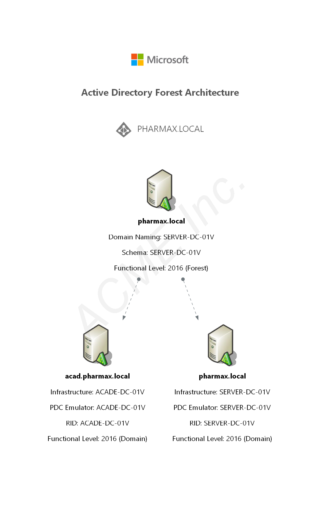
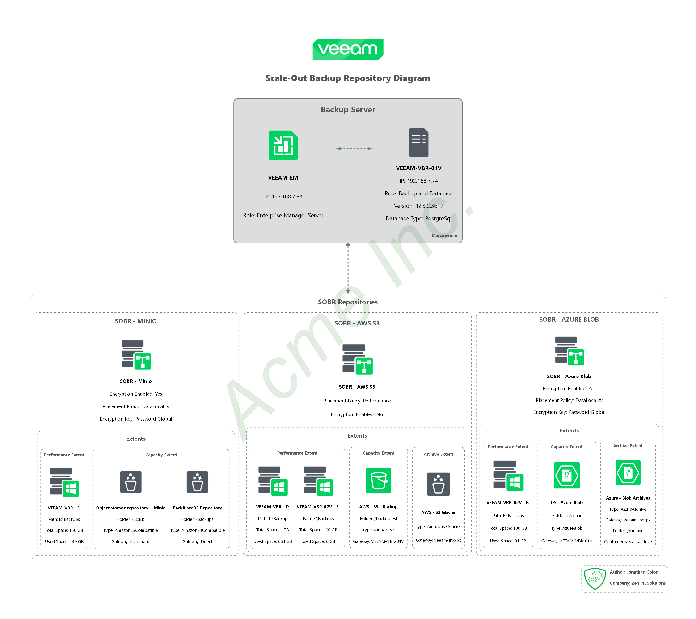
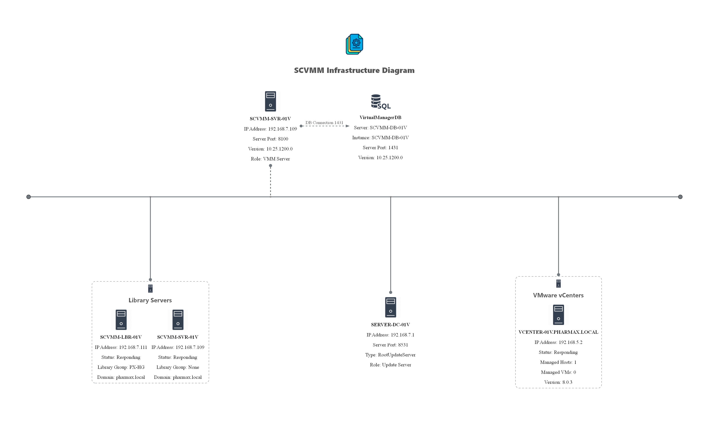
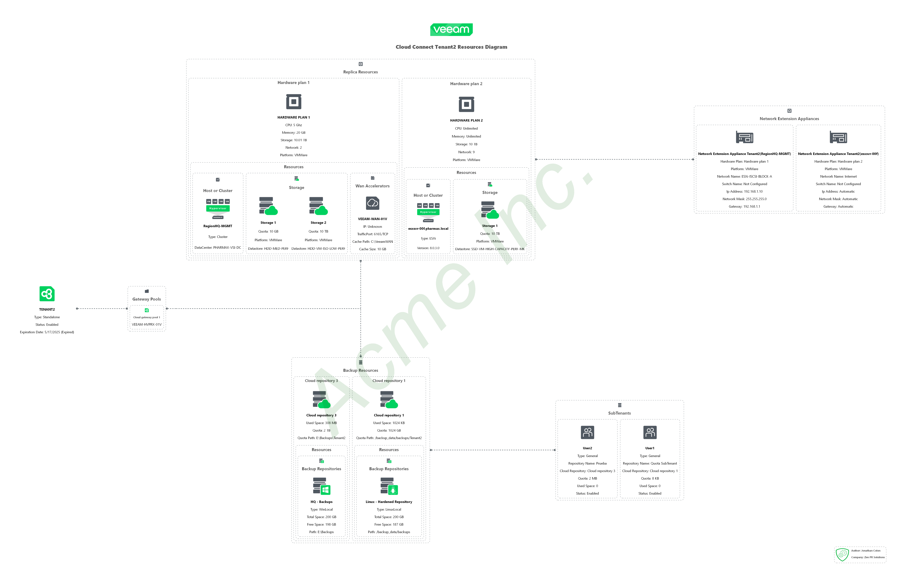

Diagrammer.Core is a foundational PowerShell module designed to streamline the creation of as-built diagrams for a wide range of datacenter systems. Serving as the core framework, it enables consistent, automated diagram generation by providing essential tools and APIs. Individual diagrammer modules for specific products or technologies depend on Diagrammer.Core to deliver accurate, customizable visual documentation, helping IT professionals efficiently capture and communicate infrastructure details.

## Objective

The objective of Diagrammer.Core is to provide a standardized, extensible platform for automating the generation of infrastructure diagrams. By abstracting common diagramming tasks and offering reusable components, the project aims to reduce manual effort, minimize errors, and improve the quality of technical documentation across diverse environments.

## Outcomes

- Accelerated creation of as-built diagrams for datacenter systems.
- Improved consistency and accuracy in infrastructure documentation.
- Simplified integration for product-specific diagrammer modules.
- Enhanced collaboration and communication among IT teams.
- Greater flexibility and customization in visualizing complex environments.

## Integrations

<!-- <table border="1" width="100%">
    <tr>
        <td align="center" valign="middle" width="50%"></td>
        <td align="center" valign="middle" width="50%"></td>
    </tr>
    <tr>
        <td align="center" valign="middle" width="50%"></td>
        <td align="center" valign="middle" width="50%"></td>
    </tr>
    <tr>
        <td align="center" valign="middle" width="50%"></td>
        <td align="center" valign="middle" width="50%"></td>
    </tr>
</table> -->

!!! example

    === "AsBuiltReport.Microsoft.AD"
        .png){ width=400 }
    === "AsBuiltReport.Netapp.Ontap"
        { width=400 }
    === "AsBuiltReport.Microsoft.SCVMM"
        { width=800 }
    === "AsBuiltReport.Veaam.VBR-SOBR"
        { width=600 }
    === "AsBuiltReport.Veeam.VB365"
        { width=600 }
    === "AsBuiltReport.Veeam.VBR-CloudConnectTenant"
        { width=800 }