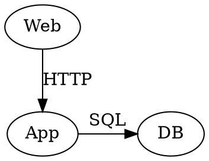

## Dependencies

Diagrammer.Core relies on the following dependencies to facilitate diagram generation and rendering.

- **PSGraph**: A PowerShell module for creating and rendering GraphViz diagrams.
- **GraphViz**: An open-source graph visualization software that provides the necessary tools to render diagrams defined in the DOT language.

These dependencies are essential for the module's functionality and performance. PSGraph is a helper module implemented as a DSL (Domain Specific Language) for generating GraphViz graphs. The goal is to make it easier to generate graphs using Powershell. The DSL adds these commands that are explained below.

- **graph**: Defines the overall graph structure and properties.
- **edge**: Represents a connection between two nodes in the graph.
- **node**: Represents an individual element or point in the graph.
- **subgraph**: Groups related nodes and edges within a larger graph.
- **rank**: Specifies the vertical positioning of nodes within the graph.

### Example Usage of PSGraph Commands

```powershell
Graph g {
    Node Web,App,DB @{shape='oval'}
    Edge Web,App @{label='HTTP'}
    Edge App,DB @{label='SQL'}
    Rank App, DB
}
```

The PSGraph commands above define a simple graph with three nodes (Web, App, DB) and two edges (Web to App with label "HTTP" and App to DB with label "SQL"). Each node is styled as an oval. The resulting code is passed to GraphViz dot.exe command that translates the PSGraph DSL into the DOT language, which is then used to generate a visual representation of the graph. Finally, the graph is rendered into an image format such as PNG, SVG etc...

### Resulting GraphViz Source Code



Until now, the example has been using PSGraph to generate the diagrams. However, to enhance the diagram rendering capabilities, Diagrammer.Core defines a bundle of custom commands that extend the PSGraph DSL. These commands are designed to simplify the creation of complex diagrams and improve the overall user experience.

As an example, Diagrammer.Core introduces the `Add-DiaNodeIcon` command, which allows users to easily add icons to nodes in the diagram. This command abstracts the complexity of manually specifying icon properties and provides a straightforward way to enhance the visual appeal of the diagrams.

### Example Usage of Diagrammer.Core Commands

```powershell

$WebServerInfo = [PSCustomObject][ordered]@{
    'OS' = 'Redhat Linux'
    'Version' = '10'
    'Build' = "10.1"
    'Edition' = "Enterprise"
}

$AppServerInfo = [PSCustomObject][ordered]@{
    'OS' = 'Windows Server'
    'Version' = '2019'
    'Build' = "17763.3163"
}

$DBServerInfo = [PSCustomObject][ordered]@{
    'OS' = 'Oracle Server'
    'Version' = '8'
    'Build' = "8.2"
    'Edition' = "Enterprise"
}

$Web01Label = Add-DiaNodeIcon -Name 'Web-Server-01' -AditionalInfo $WebServerInfo -ImagesObj $Images -IconType "Server" -Align "Center" -FontSize 18
$App01Label = Add-DiaNodeIcon -Name 'App-Server-01' -AditionalInfo $AppServerInfo -ImagesObj $Images -IconType "Server" -Align "Center" -FontSize 18
$DB01Label = Add-DiaNodeIcon -Name 'Db-Server-01' -AditionalInfo $DBServerInfo -ImagesObj $Images -IconType "Server" -Align "Center" -FontSize 18

graph g {
    Node -Name Web01 -Attributes @{Label = $Web01Label ; shape = 'plain'; fillColor = 'transparent'; fontsize = 14 }
    Node -Name App01 -Attributes @{ Label = $App01Label ; shape = 'plain'; fillColor = 'transparent'; fontsize = 14 }
    Node -Name DB01 -Attributes @{Label = $DB01Label; shape = 'plain'; fillColor = 'transparent'; fontsize = 14 }
    Edge -From Web -To App @{label='HTTP'}
    Edge -From App -To DB @{label='SQL'}
    Rank -Nodes App01, DB01
}
```

In essence, Diagrammer.Core uses the Graphviz capabilities to render HTML-like labels, which allows for a more detailed and structured representation of nodes within the diagrams. This feature enhances the clarity and comprehensibility of the diagrams, making them more effective for conveying information.

### Resulting GraphViz Source Code


In summary, Diagrammer.Core leverages the capabilities of PSGraph and GraphViz to provide a powerful and flexible solution for generating and rendering diagrams. By utilizing these dependencies, Diagrammer.Core can create visually appealing and informative diagrams that effectively communicate complex information.

